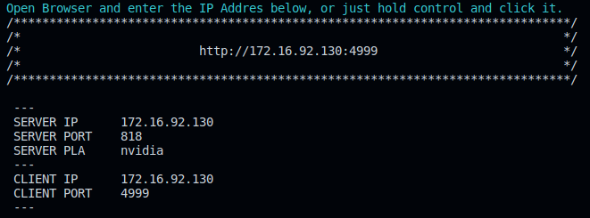
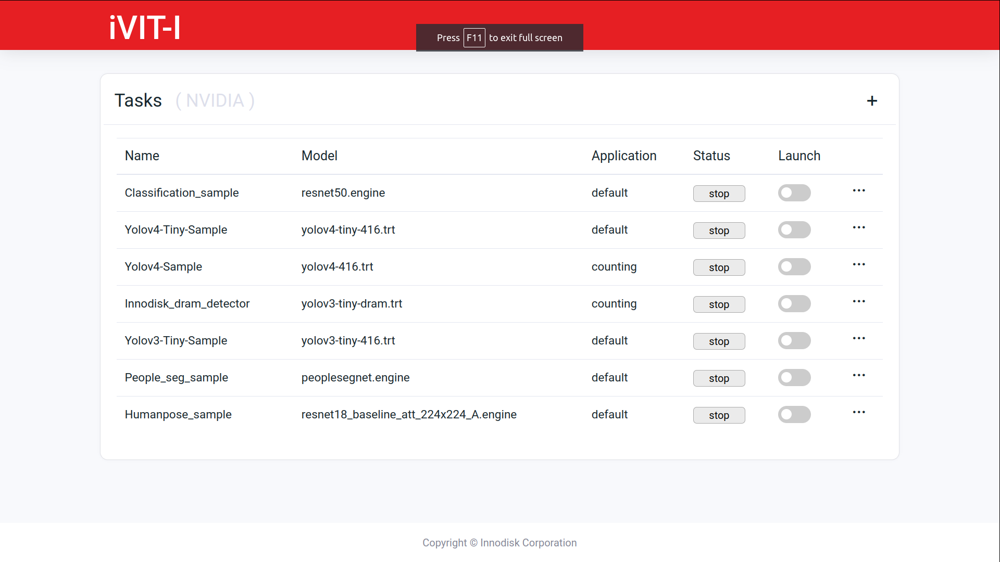
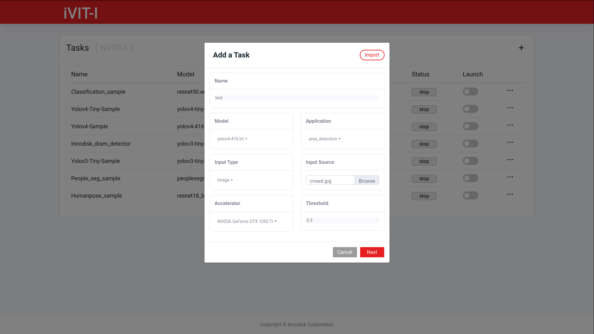
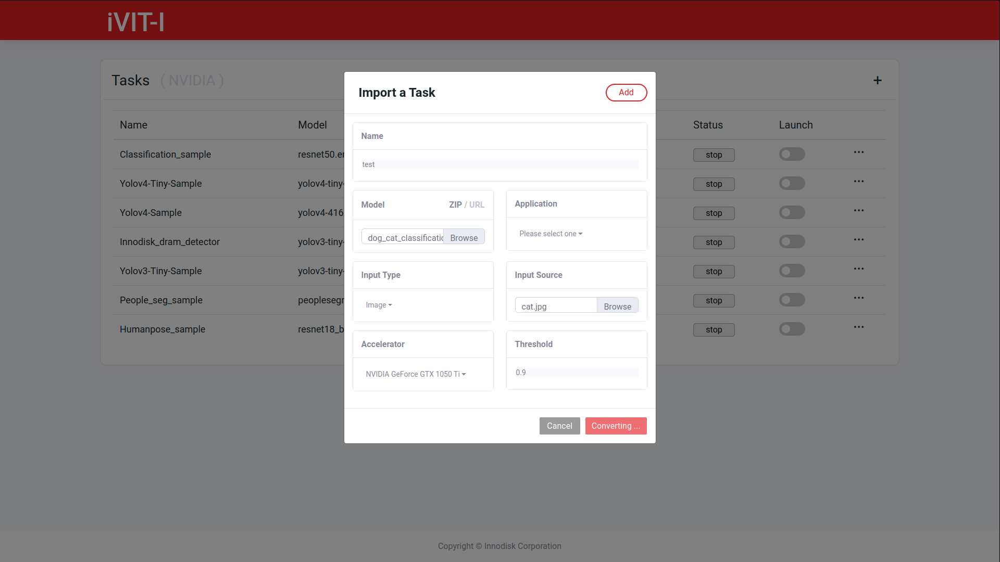
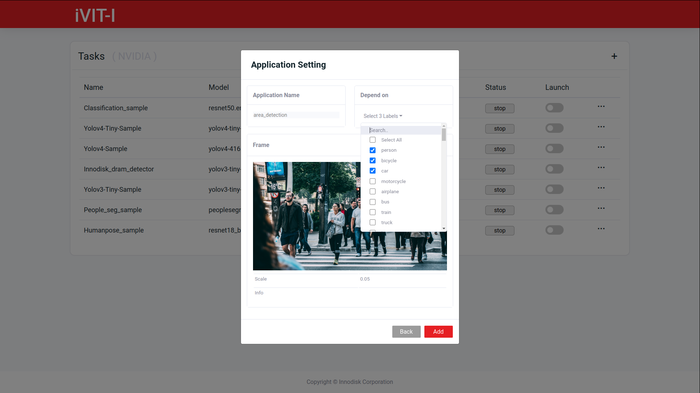
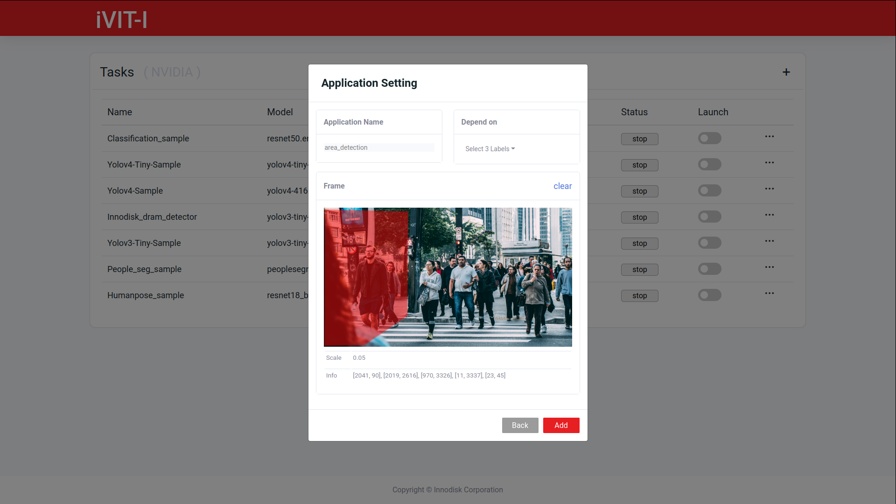
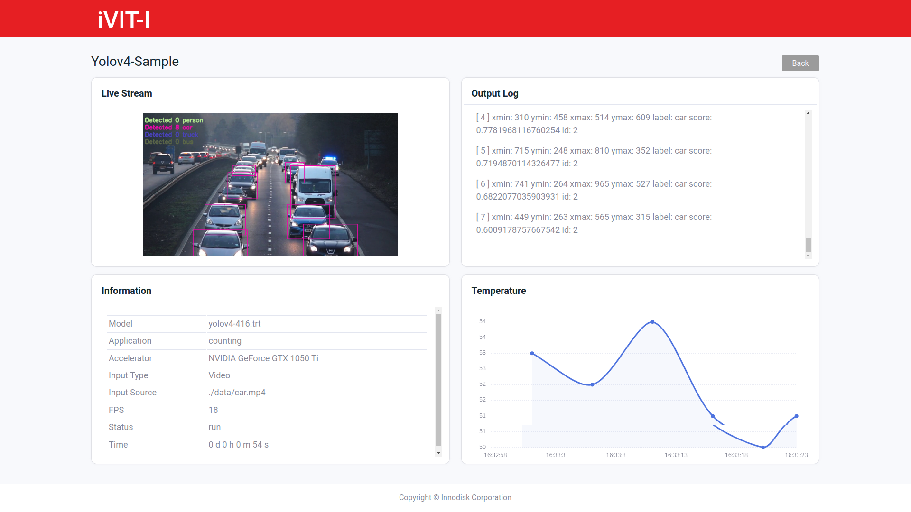

# ivit-i-web-ui
The web demo site for ivit-i

* [Requirements](#requirements)
* [How to work](#how-to-work)
* [Demo](#demo)

# Requirements
* Install [docker](https://max-c.notion.site/Install-Docker-9a0927c9b8aa4455b66548843246152f)

# How to work

1. Download the repository
    ```bash
    # Donwload repo and install python package
    $ git clone https://github.com/InnoIPA/ivit-i-web-ui.git && cd ivit-i-web-ui
    ```
2. Build the docker image
    ```bash
    $ ./docker/build.sh
    ```
3. Run the docker container

    ```bash
    $ ./docker/run.sh -i 172.16.92.130 -p 819
    ```
    
    |   Argument    |   Describe    
    |   ---         |   ---
    |   -i          |   server ip
    |   -p          |   server port

    
            
# Demo

<details>
    <summary>
        Entrance
    </summary>
    
</details>

<details>
    <summary>
        Add Event
    </summary>
    
</details>
<details>
    <summary>
        Edit and Delete Event
    </summary>
    
</details>
<details>
    <summary>
        Import Event
    </summary>
    
    
</details>
<details>
    <summary>
        Application
    </summary>
    
    
</details>
<details>
    <summary>
        Stream Page
    </summary>
    
</details>