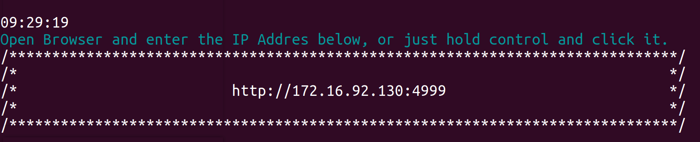
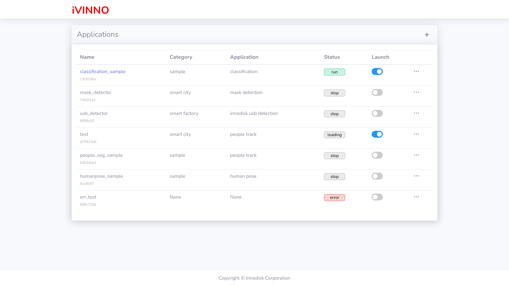
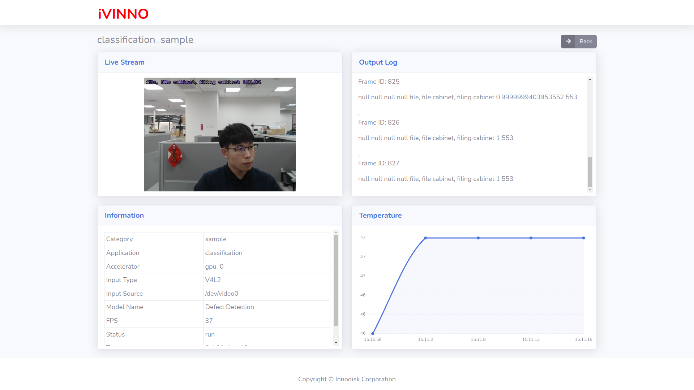
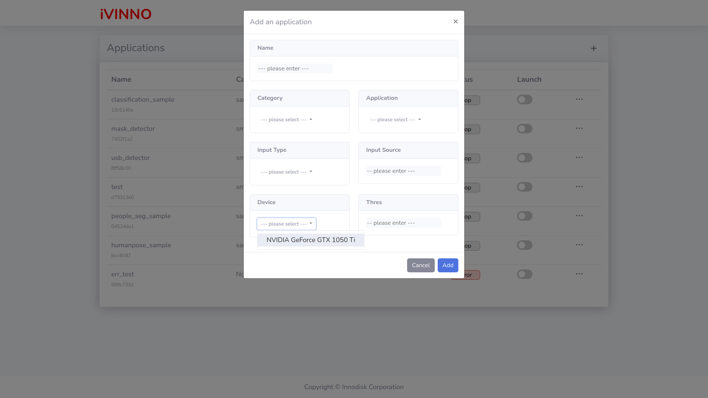
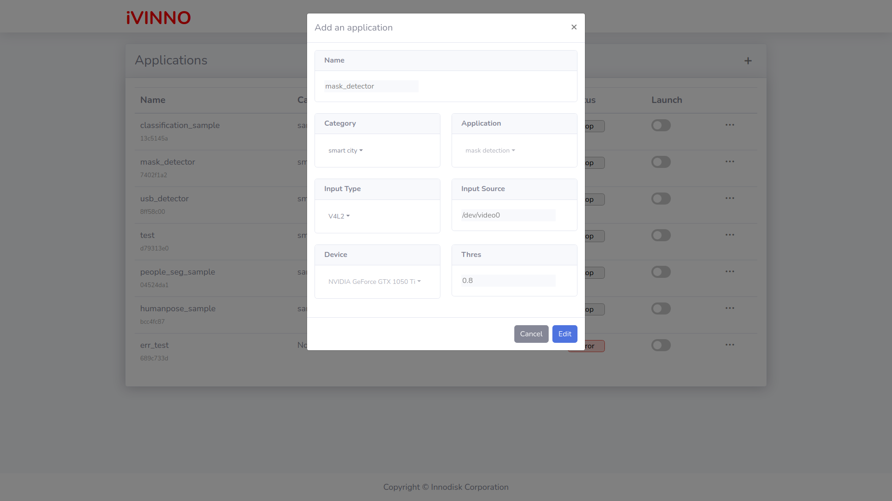

# ivit-i-demo
The web demo site for ivit-i

# Requirements
* Install [docker](https://max-c.notion.site/Install-Docker-9a0927c9b8aa4455b66548843246152f)

# How to work
1. Download the repository
    ```bash
    # Donwload repo and install python package
    $ git clone https://github.com/InnoIPA/ivit-i-demo.git && cd ivit-i-demo
    ```
2. Build the docker image
    ```bash
    $ ./docker/build.sh
    ```
3. Modify Configuration
    ```JSON
    {
        "server":{
            "ip": "172.16.92.130",
            "platform": "intel",
            "port": "819"
        },
        "client":{
            "docker_image": "ivit-i-demo",
            "ip": "0.0.0.0",
            "port": "4999"
        }
    }
    ```
    * Server: fill with the IP Address of `ivit-i-<platform>`
    * Client: shows the information of `Demo Site`
    
4. Run the docker container
    ```bash
    $ ./docker/run.sh
    
    # Run with CLI mode
    $ ./docker/run.sh -c
    ```
    

# Features
1. Entrance
   1. Capture the application list when loading the page
   2. Add an application
   3. Edit the application
   4. Delete the application
   5. Enter the stream page
2. Stream
   1. Capture GPU temperature every 5 seconds
   2. Receive image and result from backend via socketio
3. Add / Edit
   1. Enter `Application Name`
   2. Select `Category` and `Application` ( only in Add mode )
   3. Select `Input Type` and Enter `Input Source`
   4. Select `Device` ( only in Add mode )
   5. Choose the threshold

# Figures
* Entrance
    

* Stream
    

* Add 
    

* Edit
    
