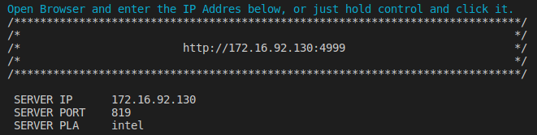

# ivit-i-demo
The web demo site for ivit-i

* [Requirements](#requirements)
* [How to work](#how-to-work)
* [Demo](#demo)

# Requirements
* Install [docker](https://max-c.notion.site/Install-Docker-9a0927c9b8aa4455b66548843246152f)

# How to work
1. Download the repository
    ```bash
    # Donwload repo and install python package
    $ git clone https://github.com/InnoIPA/ivit-i-demo.git && cd ivit-i-demo
    ```
2. Build the docker image
    ```bash
    $ ./docker/build.sh
    ```
3. Modify Configuration
    ```JSON
    {
        "server":{
            "ip": "172.16.92.130",
            "platform": "intel",
            "port": "819"
        },
        "client":{
            "docker_image": "ivit-i-demo",
            "ip": "0.0.0.0",
            "port": "4999"
        }
    }
    ```
    * Server: fill with the IP Address of `ivit-i-<platform>`
    * Client: shows the information of `Demo Site`
    
4. Run the docker container
    ```bash
    $ ./docker/run.sh
    
    # Run with CLI mode
    $ ./docker/run.sh -c
    ```
    

# Demo
> The image and video with high resolution in [my notion page](https://max-c.notion.site/iVIT-I-DEMO-v0-4-20592c5e3c11415e97540d0b72c5b706)
<details>
    <summary>
        Entrance
    </summary>
    
</details>

<details>
    <summary>
        Add Event
    </summary>
    
</details>
<details>
    <summary>
        Edit and Delete Event
    </summary>
    
</details>
<details>
    <summary>
        Import Event
    </summary>
    
</details>
<details>
    <summary>
        Run AI Task
    </summary>
    
</details>
<details>
    <summary>
        Stream Page
    </summary>
    
</details>
<details>
    <summary>
        Application
    </summary>
    
</details>
<details>
    <summary>
        Application Result
    </summary>
    
</details>